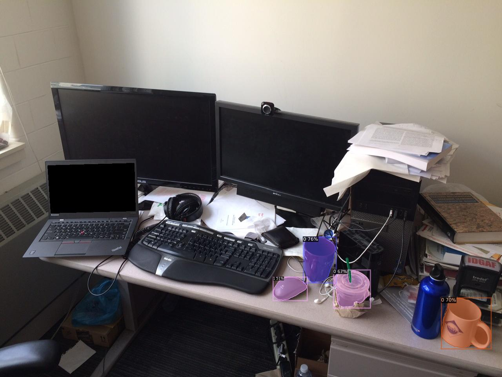

# Detic on SageMaker Sample

This example shows how to package [Detic project](https://github.com/facebookresearch/Detic/) on SageMaker to work with real time predictions for object detection. 

Detic is a Detector with image classes that can use image-level labels to easily train detectors, developed by Facebook:

> [**Detecting Twenty-thousand Classes using Image-level Supervision**](http://arxiv.org/abs/2201.02605),               
> Xingyi Zhou, Rohit Girdhar, Armand Joulin, Philipp Kr&auml;henb&uuml;hl, Ishan Misra,                 
> *arXiv technical report ([arXiv 2201.02605](http://arxiv.org/abs/2201.02605))*

## Important

> **The code within this repository comes with no guarantee, the use of this code is your responsibility. Authors have NO responsibility and/or liability for how you choose to use any of the source code available here. By using any of the files available in this repository, you understand that you are AGREEING TO USE AT YOUR OWN RISK. Once again, ALL files available here are for EDUCATION and/or RESEARCH purposes ONLY.**

## Requirements

- [Docker](https://docs.docker.com/engine/install/) locally installed to build custom image.
- Access to an AWS Account to test it on top of Sage Maker.
- Create virtualenv and install dependencies:

```
python3 -m venv .env

source .env/bin/activate

pip install -r requirements.txt
```

Install Detectron2 on virtualenv:

```
pip install 'git+https://github.com/facebookresearch/detectron2.git'
```


## Build and Test Docker Image (Locally)

To build local image, run the following command:

```
docker build -t detic-sage-maker .
```

Tag your image:
```
account=$(aws sts get-caller-identity --query Account --output text)
region=$(aws configure get region)
fullname="${account}.dkr.ecr.${region}.amazonaws.com/detic-sage-maker:latest"
docker tag detic-sage-maker ${fullname}
```

Create ECR Repo and push your image to it (must have aws cli env configured):
```
aws ecr create-repository --repository-name detic-sage-maker

aws ecr get-login-password --region ${region}|docker login --username AWS --password-stdin ${fullname}

docker push ${fullname}
```

Download Detic model on `/model` folder to test it locally:

```
wget https://dl.fbaipublicfiles.com/detic/Detic_LCOCOI21k_CLIP_SwinB_896b32_4x_ft4x_max-size.pth -O model/Detic_LCOCOI21k_CLIP_SwinB_896b32_4x_ft4x_max-size.pth
```

Run following command to start container locally and test it.

```
docker run -v $(pwd)/model:/opt/ml/model -p 8080:8080 --rm detic-sage-maker serve
```

For this example, [Local Container Notebook](local_container_test.ipynb) will be used to test that local container was built successfully.

## Test with Local SageMaker

For this example, [Local Sagemaker](local_sagemaker_sdk.ipynb) will be used to test that with SageMaker container in local mode.

Follow steps on container to execute it locally.

After testing, to check if there're any local containers running, use the command:

```
docker ps
```

If there's, it's possible to kill:

```
docker kill  <container-pid>
```

## Test Remotely on SageMaker

For this example, [Remote Sagemaker](remote_sagemaker.ipynb) will be used to test that on top of Sagemaker.

**Note: If you're going to run on Sagemaker Studio, install `requirements.txt` and `detectron2` into your kernel.**


## Predicition Examples

The notebooks are prepared to test predictions. 

There's a sample picture `desk.jpg` of a [messy desk image](https://web.eecs.umich.edu/~fouhey/fun/desk/desk.jpg) (image credit [David Fouhey](https://web.eecs.umich.edu/~fouhey)) from original Detic repo that will be used to demonstrate this sample.

Endpoint expect two parameters

1. String List with Labels: `"cup,mouse"`
2. Image in base64 sting format (already done on notebook)

Here is the sample picture before inference:

<p align="left">  </p>

Here is the output after inference:

<p align="left">  </p>